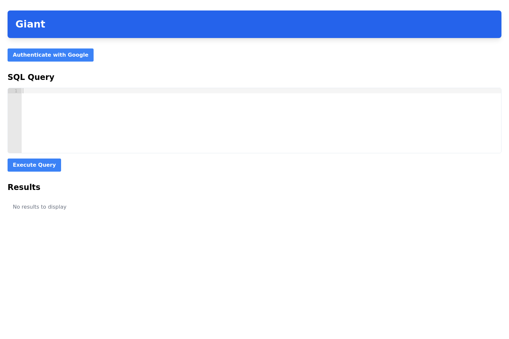

# Giant - BigQuery GUI Client

A simple GUI client for BigQuery that allows you to:
- Authenticate with Google using OAuth
- Send SQL queries to BigQuery
- View query results in a table format

## Screenshot

## Getting Started

### Backend Setup

1. Navigate to the backend directory: `cd giant/backend-js`
2. Install dependencies: `npm install`
3. Start the development server: `npm run dev`

### Frontend Setup

1. Navigate to the frontend directory: `cd giant`
2. Install dependencies: `npm install`
3. Install react-router-dom: `npm install react-router-dom`
4. Start the development server: `npm run dev`
5. Open [http://localhost:5173](http://localhost:5173) in your browser

## Features

- OAuth authentication with Google (no client credentials required)
- SQL editor with syntax highlighting
- Table view for query results

## Technologies Used

- React
- TypeScript
- Tailwind CSS
- Express.js
- Google Cloud BigQuery API
- React Ace (for SQL editor)
- Vite (for build tooling)
